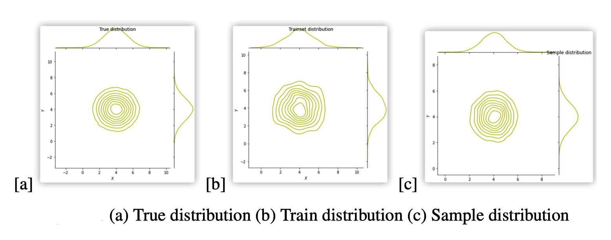
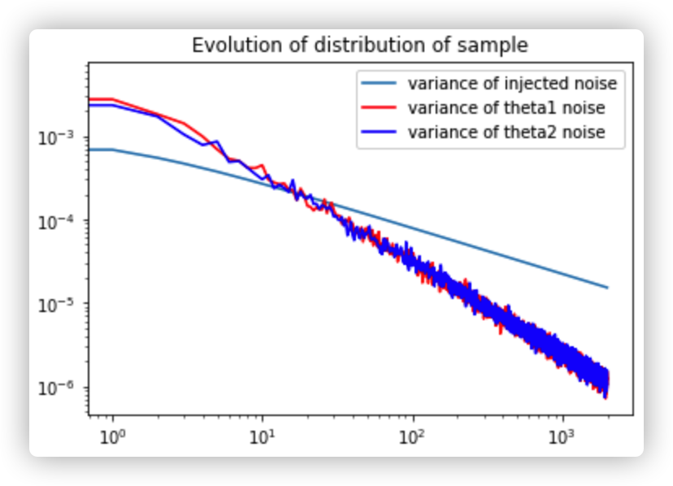

# Bayesian-Learning-via-SGLD

Implementation of the algorithm in the paper [Bayesian Learning via Stochastic Gradient Langevin Dynamics](http://www.stats.ox.ac.uk/~teh/research/compstats/WelTeh2011a.pdf).
You can find my report [here](https://github.com/LANZhengyang/Bayesian-Learning-via-SGLD/blob/main/report.pdf)





## Installation and Usage
For read only: you can just click to jump to the notebook and read them online.

For run and modify:

1) Run on Colab:(recommend)
Click the Colab button in the top of each notebook.

2) Run locally
It requires python >= 3.6 and git. 
Recommend to install packages in a virtual environment.

First clone the project
```
$ sudo install git
$ git clone https://github.com/LANZhengyang/Bayesian-Learning-via-SGLD.git

$ pip install numpy seaborn matplotlib pandas torch notebook
$ jupyter notebook
```

It will open jupyter notebook in your default browser then you can open the notebook and try to run it directly or change the hyperparameter and see the result.


## References

[1] Li, Chunyuan, et al. "Preconditioned stochastic gradient Langevin dynamics for deep neural networks." Proceedings of the AAAI Conference on Artificial Intelligence. Vol. 30. No. 1. 2016.

[1] Max Welling and Yee Whye Teh. 2011. Bayesian learning via stochastic gradient langevin dynamics. In Proceedings of the 28th International Conference on International Conference on Machine Learning (ICML'11). Omnipress, Madison, WI, USA, 681–688.

[2] Chen, T., Fox, E., & Guestrin, C. (2014, January). Stochastic gradient hamiltonian monte carlo. In International conference on machine learning (pp. 1683-1691).

[3] Ahn, Sungjin, Anoop Korattikara, and Max Welling. "Bayesian posterior sampling via stochastic gradient Fisher scoring." arXiv preprint arXiv:1206.6380 (2012).

[4] Ding, Nan, et al. "Bayesian sampling using stochastic gradient thermostats." Advances in neural information processing systems 27 (2014): 3203-3211.

[5] Moss, Adam. "Accelerated Bayesian inference using deep learning." Monthly Notices of the Royal Astronomical Society 496.1 (2020): 328-338.